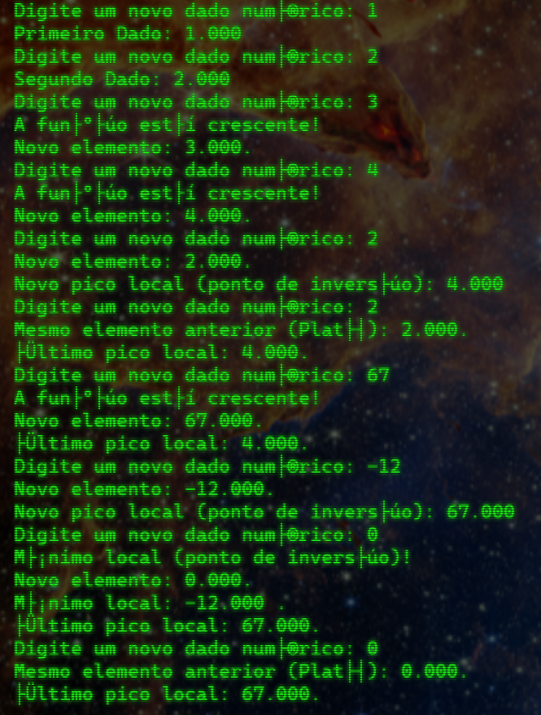

Pedido:
Escreva um programa em loop que colete continuamente valores de números e ative uma mensagem "ação crítica" se tiver uma variável de pico e depois começar a diminuir (ir recolhendo números e na hora que receber números menores que o maior registrado, aparece a mensagem).
Esse pico deve ser armazenado e reportado a cada atualização junto do número coletado.


#Main.c:
Possui o loop para inserir dados.

#Analysis.c:
Analisa os dados da função.

#List:
Cria e altera uma lista dinâmica em C.

Para rodar online, use o [GDB Online Compiler](https://onlinegdb.com/JW3FrBRUC).

Pra rodar a versão compilada (Windows x64) a partir do mesmo diretório, use o seguinte comando:

```./program```

Dê uma olhada em como fica na prática:


